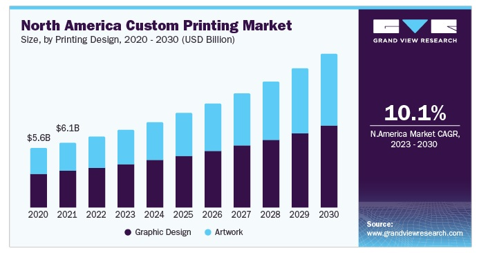

### <u>Spread Eagles Industries: Novelty Department Investment Plans</u>

## <u>Introduction</u>

Spread Eagles Industries, renowned for its premium furniture craftsmanship, is expanding its horizon. We're proud to unveil our Novelty Department, dedicated to the creation of handcrafted wooden products, both as timeless keepsakes and customizable treasures. Trophies to capture lifetime achievements. Picture Frames that enhances priceless pictures and certificates, etc.

**Montage of the new product range – Gift Pens, Picture Frames, Plaques, Trophies, Awards.**

### <u>The Vision</u>

Imagine a birthday gift that narrates a story, a Valentine's Day pen that carries meaningful words, or a Christmas plaque personalized to perfection. Our vision is to blend tradition with technology, culminating in products that are as unique as the person receiving them.

**Happy customers receiving personalized gifts during various occasions – Birthdays, Christmas, New Year, etc.**

***Why would someone support this idea?***

- Unique Selling Proposition: Customization in wooden craft is a niche yet rapidly expanding market.
- High Returns: A laser engraving machine and a CNC machine can exponentially increase the production rate, ensuring higher sales and profits.
- Sustainability: Wooden products are not only biodegradable but also carry an earthy aesthetic, making them a favorite for eco-conscious customers.

**There is a rise in demand for personalized wooden products over recent years.**

<u>Our Needs</u>

#### To actualize this vision, we're seeking grant funding to source the following:

- Laser Engraving Machine: For precise, detailed, and rapid personalizations.
- CNC Machine: To carve intricate designs, ensuring each product stands out.
- Miscellaneous Equipment: To bolster our manufacturing and customization processes.

**A sleek visualization of the laser engraving machine and CNC machine, with close-ups of the detailed work they can produce.**

https://www.youtube.com/watch?v=EvBrQWtaWxI

<iframe width="560" height="315" src="https://www.youtube.com/embed/xAfrYH1Ga1Y?si=VwSCAJnpvAtBghtA" title="YouTube video player" frameborder="0" allow="accelerometer; autoplay; clipboard-write; encrypted-media; gyroscope; picture-in-picture; web-share" allowfullscreen></iframe>

### <u>The Impact</u>

<u>With these machines:</u>

- Production capacity will multiply tenfold.
- Customization requests can be fulfilled in record time.
- We can reach new markets and customers, from corporate gifts to wedding memorabilia.

### <u>Conclusion</u>

Spread Eagles Industries has always been a beacon of quality and innovation in the furniture industry. By supporting our Novelty Department's vision, you're not just investing in machinery; you're investing in countless moments of joy, memories, and personalized treasures for people around the world.

#### <u>Join us in crafting the future of personalized wooden novelties!</u>

> Contact Details:
> Spread Eagles Industries
> 10 Robinson Road
> Kingston 10
> Jamaica, W.I.

#### <u>Watch the following video to see more of what can be done with a CNC Mahine</u>

<iframe width="560" height="315" src="https://www.youtube.com/embed/CuRi2wfsbRI?si=uXkd6DjXYzaYEwB1" title="YouTube video player" frameborder="0" allow="accelerometer; autoplay; clipboard-write; encrypted-media; gyroscope; picture-in-picture; web-share" allowfullscreen></iframe>

